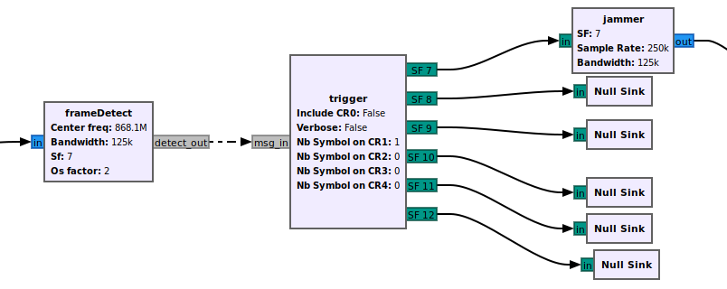

# LoRaJam GNU Radio implementation

## Overview

This a GNU Radio implementation of a LoRaWAN Reactive Jammer. It was designed in the scope of an experiment aiming at finding the number of jamming symbols required to spoil the network throughput to a certain level, considering different network parameters.
It provides an interface for setting in advance the number of symbols transmitted by the jammer, for each possible coding rate (CR) value detected in the frame header.



It is composed of three blocks []:

- frameDetect: in charge of detecting a LoRa frame start (looking for a preamble) given the physical layer parameters such as the channel, the bandwidth, the spreading factor. Upon a frame detection, it decodes the header and forwards the CR with the SF to the `trigger` block.
- trigger: configured with the number of symbol for each value of CR, it randomly generate the corresponding number of symbols and according to the SF when it receives a detection message from a `frameDetect` block. The generated number(s) is/are transmitted to the `jammer` block for modulation.
- jammer: modulates any number received according to the physical layer parameters it is configured with (bandwith, sample rate, sf) and transmits it to the next block that could be a hardware sink (a SDR for example).


## Installation
Assuming you already have GNU Radio installed on your system,

- Clone this repo:
```bash 
    git clone [text](https://github.com/ssuDoS/gr-loraJam.git)
```

- Go to the newly cloned repo:
```bash
    cd gr-loraJam
```

- Create a build directory, and move into it:
```bash
    mkdir build
    cd build
```

- Generate build files (if using `conda`):
```bash
    cmake .. -DCMAKE_INSTALL_PREFIX=$CONDA_PREFIX
```
Make sure the right conda environment is currently active.  
If using installing default system location instead, simply use:
```bash
    cmake ..
```

- Compile the jammer (if using `conda`):
```bash
    make install -j$(nproc)
```
If installing to the default system location instead (probably /usr/local), `sudo` right is required:
```bash
    sudo make install -j$(nproc)
```

- If the default system location option is used (with `sudo`), then let the dynamic linker know about the new binaries with:
```bash
    sudo ldconfig
```

That's it ! You are now all set. You can view the new blocks by opening GNU Radio Companion if installed:
```bash
    gnuradio-companion &
```

Enjoy your time with the reactive jammer.


## Credit

The implementation of the frame detection is inspired from and based on the GNU Radio implementation of a LoRa transceiver at [https://github.com/tapparelj/gr-lora_sdr](https://github.com/tapparelj/gr-lora_sdr) 
